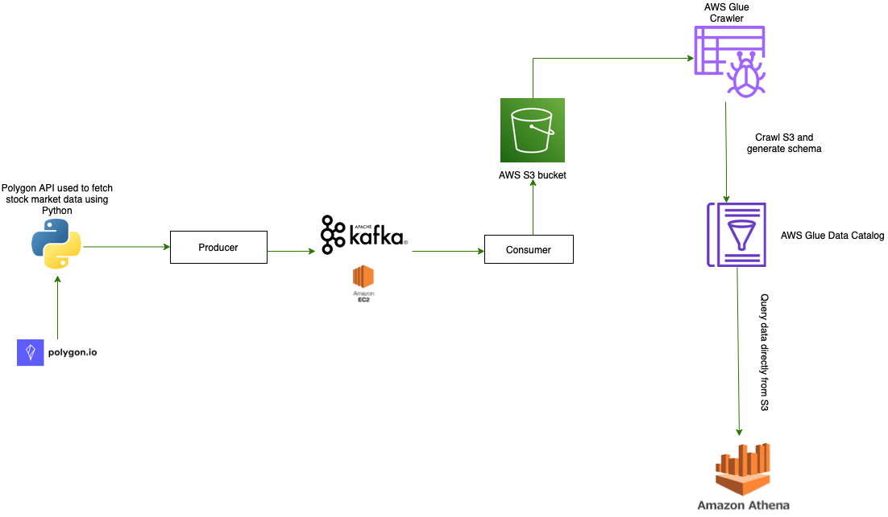

# Polygon Market Data Real-Time Data Analysis Using Kafka
This is an End-To-End Data Engineering Project on Real-Time Stock Market Data, using AWS and Kafka. 

### Technologies used
- <b>Apache Kafka</b>: This is an event streaming platform used to collect, process, store, and integrate data at scale. Its Python API was utilized to stream data received from the web API  
- <b>AWS EC2</b> : This is a cloud-based computing service that allows users to quickly launch virtual servers and manage cookies, security, and networking from an easy-to-use dashboard. It was used to host Kafka server for this project.   
- <b>AWS S3</b>: This is a highly scalable object storage service that stores data as objects within buckets. It is commonly used to store and distribute large media files, data backups and static website files. For this project it is used to store data streamed from kafka.   
- <b>AWS Glue</b> :Glue Crawler is a fully managed service that automatically crawls your data sources, identifies data and infer schemas to create an AWS Glue Data Catalog. This Catalog is a fully managed metadata repository that makes it easy to discover and manage data that has been crawled.It allows us to query the data directly from S3 without loading it first.   
- <b>AWS Athena</b>: Athena is an interactive query service that makes it easy to analyze data in Amazon S3 using SQL commands. For this project it is used to analyze data in Glue Data Catalog or in other S3 buckets.   

## Architecture

### Languages used
- Python

### Datasets
we will use Polygon's Stock API to fetch real-time stock trade data. Polygon is a financial data platform that provides both real-time and historical market data for Stocks, Options, Forex, and Crypto. With access to this information, developers, investors, and financial institutions can gain valuable insights and make informed decisions. <li><a href='https://docs.aws.amazon.com/athena/latest/ug/getting-started.html](https://polygon.io/blog/polygon-io-with-python-for-stock-market-data/)'>Polygon Website link</a></li>

#### Development Process
1. Created EC2 Instance (AWS Linux AMI 2) to run python consumer file and host kafka  
2. Installed Kafka and Java on ec2 Instance, and ran kafka and zookeper in background to test producer and consumer clients 
3. Created S3 Bucket and IAM role to enable access to s3 from any instance  
4. Created and ran crawler on AWS Glue. This includes creating a database, chosing a data source, amd creating an IAM role that allows Glue to access S3 
5. Access Athena to preview data, with time the number of rows increases due to the cron job that runs hourly on aws lamdba. 

#### Pipeline Flow
Polygon Stock Market data  -> Fetch data using Polygon API & transform data -> move to producer client -> consumer reads data and uploads to s3 -> Data schema is crawled through Glue -> Athena queries data directly from s3   

#### Necessary Files
1. Kafka commands can be found <a href="">here</a>
2. Generated app through SAM can be found <a href="https://github.com/priye-1/Real_time_End_to_End_Pipeline_using_Kafka/tree/master/kafka-lambda-app">here</a> This module contains the kafka producer and transformation code.
3. Kafka Consumer file can be found <a href="https://github.com/priye-1/Real_time_End_to_End_Pipeline_using_Kafka/blob/master/kafka_consumer.py">here</a>
